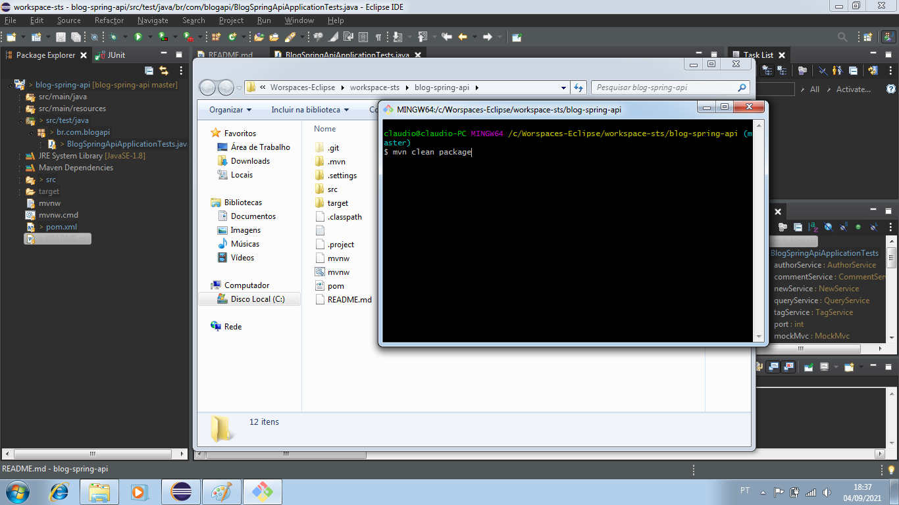
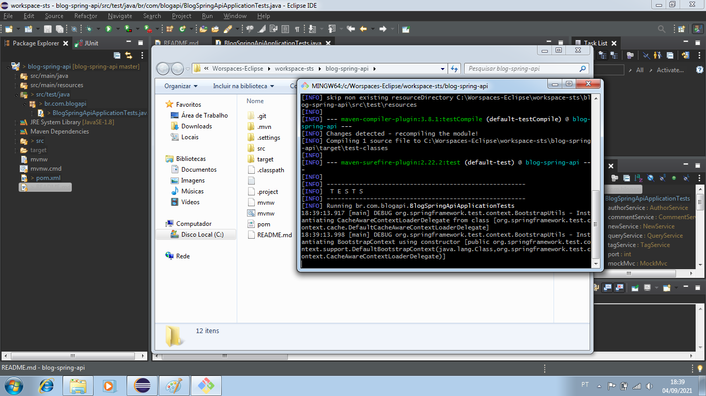
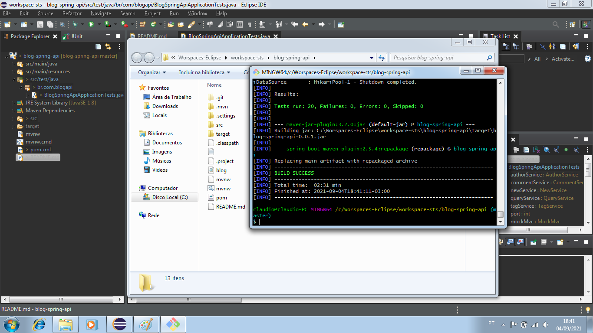
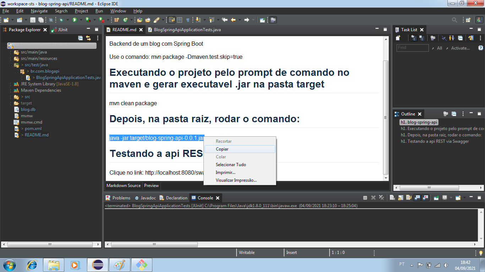
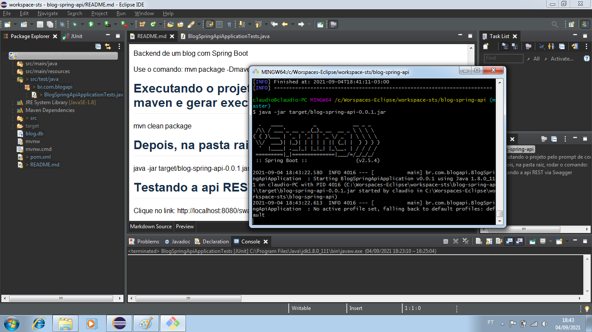
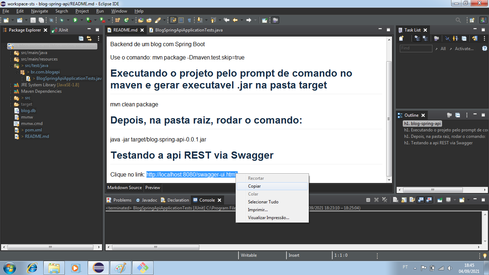
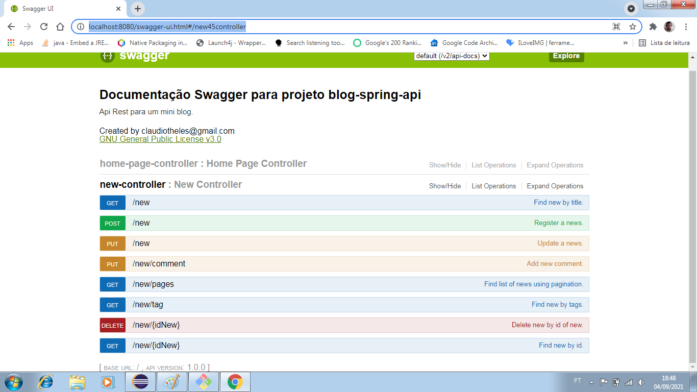
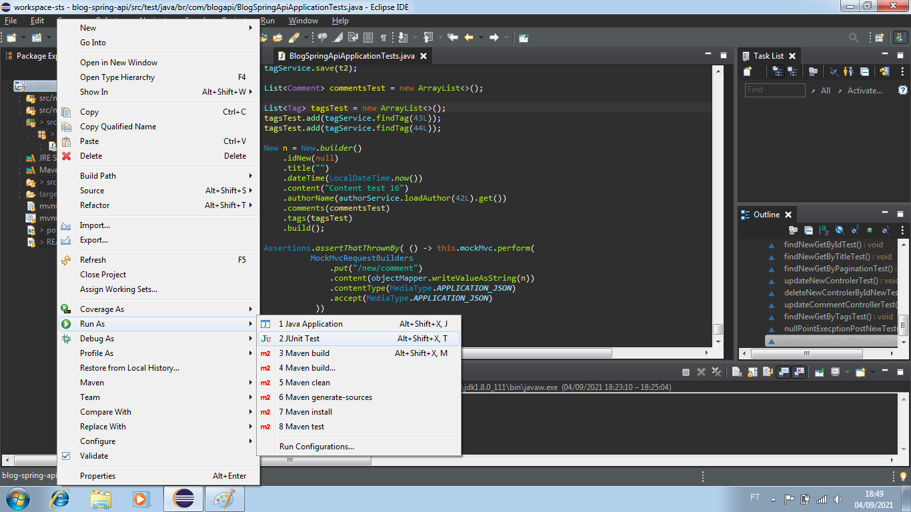
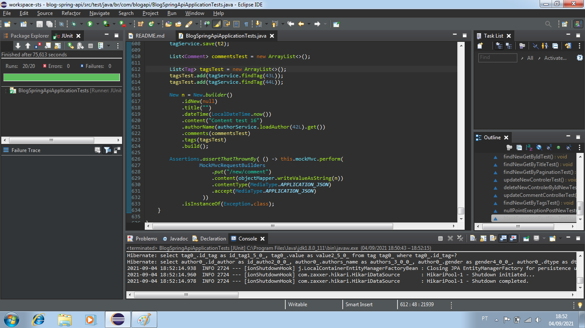

# blog-spring-api
Backend de um blog com Spring Boot

Use o comando: mvn package -Dmaven.test.skip=true

# Executando o projeto pelo prompt de comando no maven e gerar executavel .jar na pasta target

mvn clean package

 

Inicio dos testes

 
Fim dos testes

 

Rodando o projeto através do executavel .jar na raiz do projeto: blog-spring-api

java -jar target/blog-spring-api-0.0.1.jar

 

Link para rodar o Swagger

Clique no link: http://localhost:8080/swagger-ui.html

 

 

Executando o teste Junit direto no Eclipse no local do arquivo de teste: 

/blog-spring-api/src/test/java/br/com/blogapi/BlogSpringApiApplicationTests.java

 

Resultado dos testes

